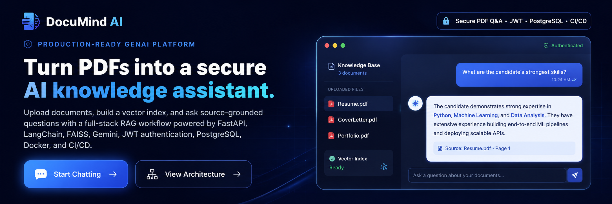
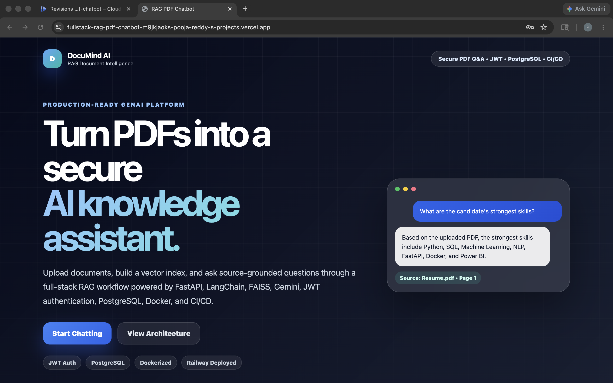
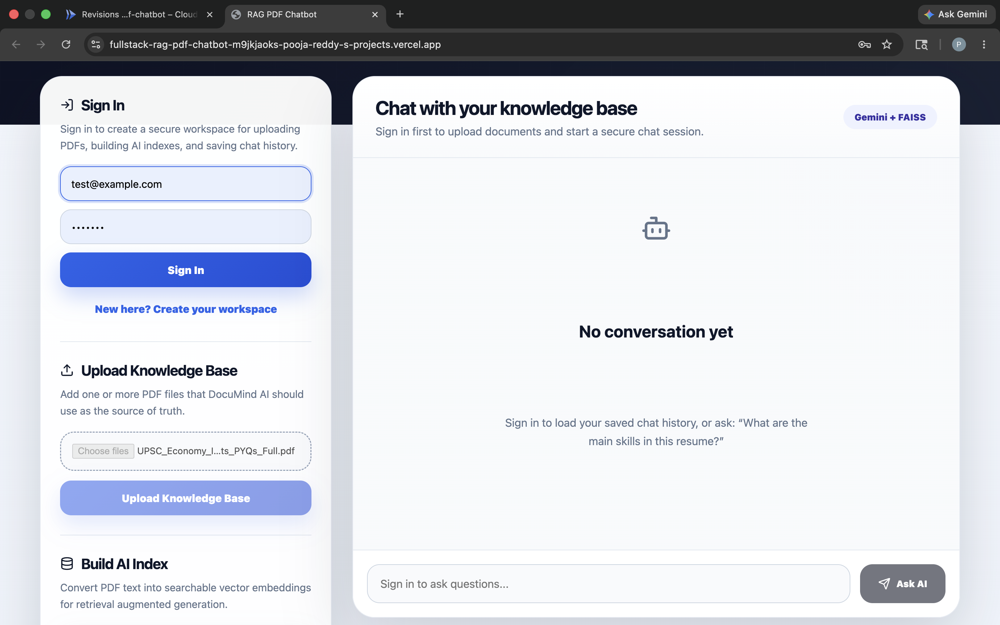
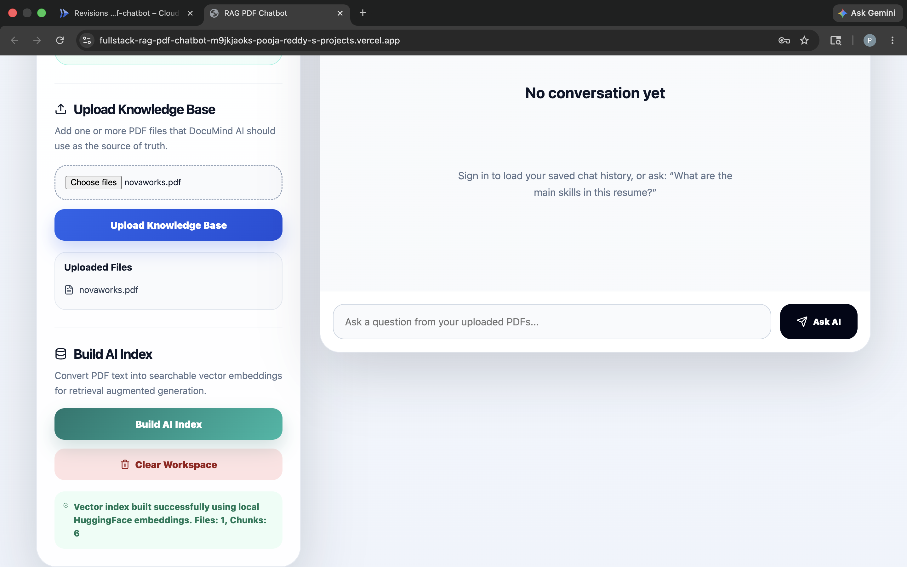
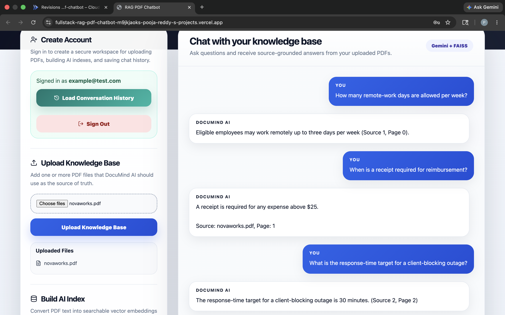
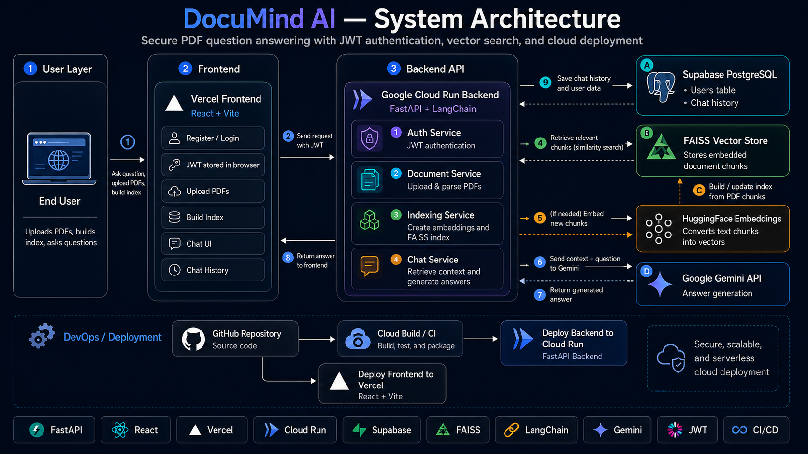
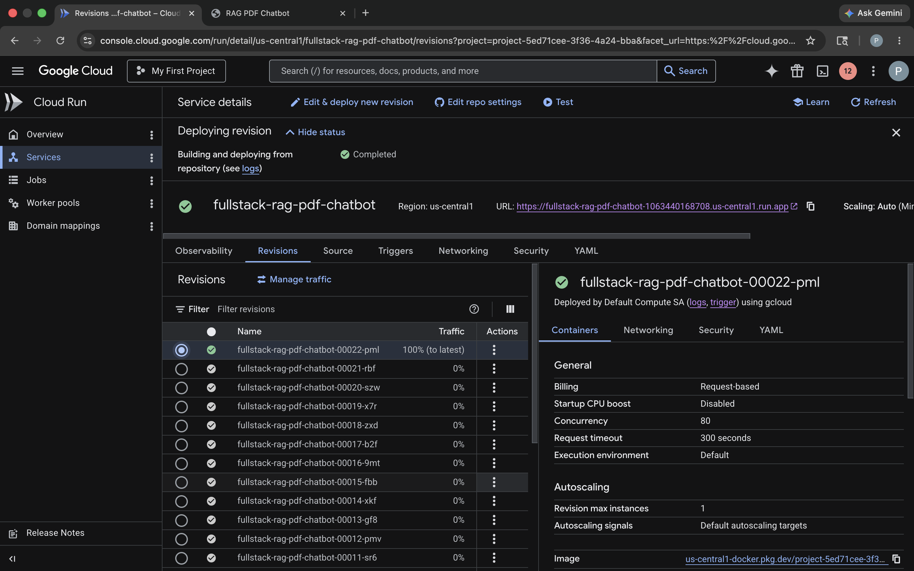

<div align="center">



<br />

# DocuMind AI

### Secure, cloud-deployed PDF intelligence powered by Retrieval-Augmented Generation

Upload documents, build a vector index, and ask source-grounded questions through a full-stack AI knowledge assistant.

<br />

[](https://react.dev/)
[](https://fastapi.tiangolo.com/)
[](https://cloud.google.com/run)
[](https://vercel.com/)
[](https://supabase.com/)
[](https://www.docker.com/)

<br />

[Live Application](PASTE_YOUR_STABLE_VERCEL_URL_HERE) •
[Backend API](https://fullstack-rag-pdf-chatbot-1063440168708.us-central1.run.app) •
[Swagger Docs](https://fullstack-rag-pdf-chatbot-1063440168708.us-central1.run.app/docs) •
[Health Check](https://fullstack-rag-pdf-chatbot-1063440168708.us-central1.run.app/health)

</div>

---

## Overview

**DocuMind AI** is a full-stack Retrieval-Augmented Generation application that transforms uploaded PDF files into an interactive AI knowledge base.

Users can securely create an account, upload documents, build a searchable vector index, and ask questions grounded in the uploaded content. The backend retrieves relevant document chunks through vector similarity search and sends the retrieved context to Gemini for answer generation.

The project demonstrates an end-to-end GenAI workflow across frontend development, API design, authentication, database integration, vector retrieval, containerization, CI/CD, and cloud deployment.

---

## What the Application Does

```text
Upload PDFs
    ↓
Extract and split document text
    ↓
Generate Hugging Face embeddings
    ↓
Store vectors in a FAISS index
    ↓
Ask a question
    ↓
Retrieve the most relevant chunks
    ↓
Send question + retrieved context to Gemini
    ↓
Return a source-grounded answer
```

---

## Application Preview

### Landing Page



### Secure Authentication



### PDF Upload and AI Index Creation



### Source-Grounded AI Response



---

## System Architecture



### Request Flow

1. The user registers or logs in through the React frontend.
2. The backend validates credentials and returns a JWT access token.
3. The frontend stores the token and sends it with protected API requests.
4. The user uploads one or more PDF documents.
5. The backend extracts text, splits it into chunks, and generates embeddings.
6. FAISS stores the embedded document chunks for similarity search.
7. When the user asks a question, the backend retrieves relevant chunks from FAISS.
8. Gemini generates an answer using the retrieved document context.
9. The backend stores user and chat-history data in Supabase PostgreSQL.
10. The response is returned to the frontend and displayed in the chat interface.

---

## Key Features

### AI and Retrieval

* PDF-based Retrieval-Augmented Generation workflow
* Text extraction and chunking
* Hugging Face sentence-transformer embeddings
* FAISS vector similarity search
* Gemini-powered source-grounded answers
* Multi-document knowledge-base support

### Authentication and Data

* User registration and login
* JWT-based authentication
* Protected FastAPI endpoints
* Supabase PostgreSQL integration
* User and chat-history storage
* Cross-origin request handling for Vercel deployments

### Cloud and DevOps

* Dockerized FastAPI backend
* Google Cloud Run deployment
* Request-based billing and scale-to-zero configuration
* Vercel deployment for the React frontend
* GitHub-connected Cloud Build deployment pipeline
* CI workflow for backend tests, frontend build validation, and Docker build checks

---

## Technology Stack

| Layer             | Technologies                                          |
| ----------------- | ----------------------------------------------------- |
| Frontend          | React, Vite, JavaScript, CSS, Lucide React            |
| Backend           | Python, FastAPI, Uvicorn, SQLAlchemy                  |
| RAG Orchestration | LangChain                                             |
| Embeddings        | Hugging Face Sentence Transformers                    |
| Vector Search     | FAISS                                                 |
| LLM               | Google Gemini API                                     |
| Authentication    | JWT, Passlib                                          |
| Database          | Supabase PostgreSQL                                   |
| Containerization  | Docker                                                |
| Backend Hosting   | Google Cloud Run                                      |
| Frontend Hosting  | Vercel                                                |
| CI/CD             | GitHub Actions, Google Cloud Build, Artifact Registry |

---

## API Endpoints

| Method   | Endpoint         | Authentication | Purpose                                                  |
| -------- | ---------------- | -------------- | -------------------------------------------------------- |
| `GET`    | `/health`        | Public         | Check backend health                                     |
| `POST`   | `/auth/register` | Public         | Register a new user                                      |
| `POST`   | `/auth/login`    | Public         | Log in and receive a JWT token                           |
| `POST`   | `/upload`        | Required       | Upload one or more PDF files                             |
| `POST`   | `/build-index`   | Required       | Generate embeddings and build the FAISS index            |
| `POST`   | `/chat`          | Required       | Ask questions from uploaded PDFs                         |
| `GET`    | `/chat-history`  | Required       | Load the authenticated user's saved conversation history |
| `DELETE` | `/reset`         | Required       | Clear uploaded files and reset the knowledge base        |

> Endpoint names should match the routes in your FastAPI application. Remove any row that does not exist in your current backend.

---

## Project Structure

```text
Fullstack-RAG-PDF-Chatbot/
│
├── backend/
│   ├── app/
│   │   ├── auth.py
│   │   ├── database.py
│   │   ├── main.py
│   │   └── __init__.py
│   ├── tests/
│   │   └── test_health.py
│   ├── Dockerfile
│   ├── requirements.txt
│   ├── .env.example
│   └── .env
│
├── frontend/
│   ├── src/
│   │   ├── main.jsx
│   │   └── styles.css
│   ├── Dockerfile
│   ├── package.json
│   ├── vite.config.js
│   ├── .env.example
│   └── .env
│
├── screenshots/
│   ├── documind-readme-header.png
│   ├── documind-system-architecture.png
│   ├── home-page.png
│   ├── login-page.png
│   ├── upload-and-index.png
│   ├── chat-response.png
│   └── cloud-run-deployment.png
│
├── .github/
│   └── workflows/
│       └── ci.yml
│
├── docker-compose.yml
├── .gitignore
└── README.md
```

---

## Local Development Setup

### Prerequisites

Install:

* Python 3.11+
* Node.js 18+
* Git
* A Supabase PostgreSQL database
* A Gemini API key

### 1. Clone the Repository

```bash
git clone https://github.com/pooja211reddy/Fullstack-RAG-PDF-Chatbot.git
cd Fullstack-RAG-PDF-Chatbot
```

### 2. Configure the Backend

Create:

```text
backend/.env
```

Add:

```env
GOOGLE_API_KEY=your_gemini_api_key
GEMINI_CHAT_MODEL=gemini-2.5-flash
JWT_SECRET_KEY=your_secure_random_secret
JWT_ALGORITHM=HS256
ACCESS_TOKEN_EXPIRE_MINUTES=60
DATABASE_URL=your_supabase_postgresql_connection_string
```

Do not commit `.env` files to GitHub.

### 3. Start the Backend

```bash
cd backend
python3 -m venv .venv
source .venv/bin/activate
pip install -r requirements.txt
python -m uvicorn app.main:app --reload
```

The local backend will run at:

```text
http://127.0.0.1:8000
```

Swagger documentation:

```text
http://127.0.0.1:8000/docs
```

### 4. Configure the Frontend

Create:

```text
frontend/.env
```

Add:

```env
VITE_API_BASE_URL=http://127.0.0.1:8000
```

### 5. Start the Frontend

```bash
cd frontend
npm install
npm run dev
```

The frontend will run at:

```text
http://localhost:5173
```

---

## Docker Setup

Build and run the backend container locally:

```bash
cd backend
docker build -t documind-backend .
docker run \
  --env-file .env \
  -p 8080:8080 \
  documind-backend
```

Test the container:

```text
http://localhost:8080/health
```

---

## Cloud Deployment

### Frontend — Vercel

```text
GitHub Repository
        ↓
Vercel Build
        ↓
React + Vite Production Deployment
```

Vercel environment variable:

```env
VITE_API_BASE_URL=https://fullstack-rag-pdf-chatbot-1063440168708.us-central1.run.app
```

### Backend — Google Cloud Run

```text
GitHub Push
        ↓
Google Cloud Build
        ↓
Artifact Registry
        ↓
Google Cloud Run Revision
```

Current Cloud Run configuration:

```text
Region: us-central1
Billing: Request-based
Minimum instances: 0
Maximum instances: 1
Memory: 2 GiB
Container port: 8080
Ingress: Public
```



---

## CI/CD Pipeline

The repository includes automated validation for:

```text
Backend Tests
Frontend Production Build
Docker Image Build
```

The backend deployment pipeline is connected to GitHub through Google Cloud Build.

```text
Push to main
      ↓
Cloud Build Trigger
      ↓
Docker Image Build
      ↓
Artifact Registry
      ↓
Cloud Run Revision Deployment
```

For CI tests, use a temporary SQLite database instead of production Supabase credentials:

```yaml
env:
  DATABASE_URL: sqlite:///./test.db
  JWT_SECRET_KEY: test_secret_key_for_ci_only
  JWT_ALGORITHM: HS256
  ACCESS_TOKEN_EXPIRE_MINUTES: 60
```

---

## Security Notes

Implemented:

* JWT authentication
* Protected API endpoints
* Password hashing
* Explicit CORS configuration
* Environment-based secrets
* PostgreSQL-backed user storage

Not yet implemented:

* Supabase Row-Level Security policies
* Restricted database runtime role
* Rate limiting
* Secret Manager integration
* File-size validation and malware scanning

These are planned production-hardening improvements.

---

## Current Limitations

### Ephemeral Storage

Uploaded PDFs and FAISS indexes are currently stored inside the Cloud Run container.

Cloud Run containers are ephemeral. If the container restarts or scales down, users may need to upload their files and rebuild the vector index.

### Recommended Next Upgrade

Replace local container storage with:

```text
PDF Storage      → Supabase Storage or Google Cloud Storage
Vector Database  → Qdrant Cloud, Pinecone, Weaviate, or pgvector
Database Access  → Restricted PostgreSQL role + RLS policies
Schema Changes   → Alembic migrations
Indexing Jobs    → Background worker or task queue
```

---

## Roadmap

* [x] React frontend
* [x] FastAPI backend
* [x] PDF upload workflow
* [x] FAISS vector search
* [x] Hugging Face embeddings
* [x] Gemini integration
* [x] JWT authentication
* [x] Supabase PostgreSQL integration
* [x] Chat-history storage
* [x] Docker containerization
* [x] Google Cloud Run deployment
* [x] Vercel frontend deployment
* [x] Cloud Build deployment pipeline
* [ ] Persistent object storage
* [ ] Persistent managed vector database
* [ ] Supabase RLS policies
* [ ] Rate limiting
* [ ] Secret Manager integration
* [ ] Alembic migrations
* [ ] Automated RAG evaluation

---

## Recruiter-Friendly Project Summary

DocuMind AI demonstrates the implementation of a secure, cloud-deployed GenAI application across the full software lifecycle:

```text
Frontend Development
API Engineering
JWT Authentication
PostgreSQL Integration
Vector Search
Retrieval-Augmented Generation
Docker Containerization
CI/CD
Cloud Deployment
```

---

## Author

Developed as a full-stack GenAI portfolio project to demonstrate secure RAG architecture, cloud deployment, and production-oriented software engineering practices.

---

<div align="center">

### Turn your PDFs into an AI-powered knowledge base

[Try DocuMind AI](PASTE_YOUR_STABLE_VERCEL_URL_HERE)

</div>
